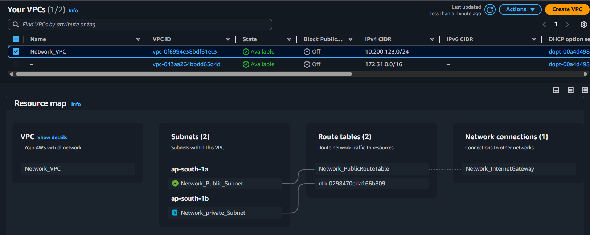
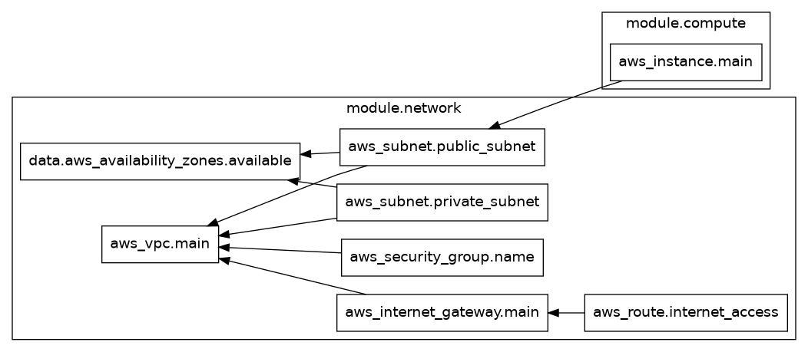
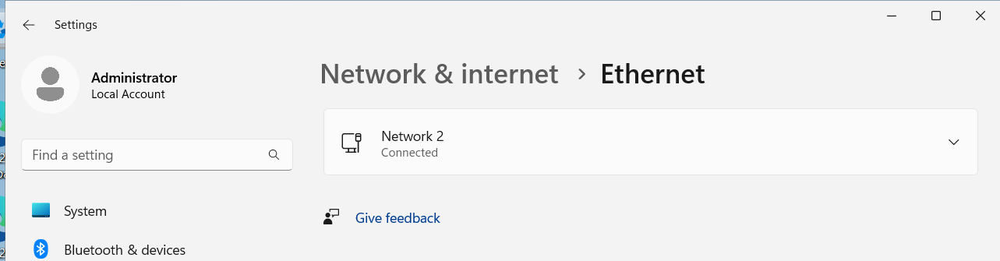
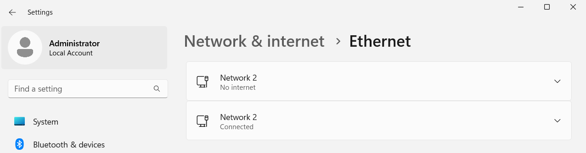

# exp-net-fundamentals--2025-Q2
Network Bootcamp

This project demonstrates how to set up a network infrastructure in AWS using Terraform. It includes the creation of a VPC, subnets, security groups, and EC2 instances, along with additional configurations like attaching an Elastic Network Interface (ENI).

---

## Network Setup in AWS

### IP Addressing
- **VPC CIDR Block**: `10.200.123.0/24` → 251 usable IPs total.
- **Subnet Allocation**:
  - `10.200.123.0/25` → Public Subnet → 123 usable IPs.  
    IP Range: `10.200.123.0 - 10.200.123.127`
  - `10.200.123.128/25` → Private Subnet → 123 usable IPs.  
    IP Range: `10.200.123.128 - 10.200.123.255`



---

## Terraform Setup

### Prerequisites
1. Install Terraform:
   ```bash
   sudo apt update && sudo apt install -y terraform
   ```
2. Install Graphviz for visualizing the Terraform graph:
   ```bash
   sudo apt update && sudo apt install graphviz -y
   ```

### Initialize Terraform
Run the following command to initialize the Terraform workspace:
```bash
terraform init
```

### Generate Terraform Graph
To visualize the resource dependencies:
```bash
terraform graph | dot -Tpng > graph.png
```
To exclude certain resources from the graph:
```bash
terraform graph | grep -v 'aws_route_table_association' | grep -v 'aws_security_group_rule' | grep -v 'aws_route_table.public' | grep -v 'data.http.my_ip' | dot -Tpng -o graph-no-assoc.png
```



---

## Terraform Modules

### Network Module
The [network module](modules/network/main.tf) is responsible for creating the following resources:
- **VPC**: Defined in `aws_vpc.main`.
- **Public Subnet**: Defined in `aws_subnet.public_subnet`.
- **Private Subnet**: Defined in `aws_subnet.private_subnet`.
- **Internet Gateway**: Defined in `aws_internet_gateway.main`.
- **Route Table**: Defined in `aws_route_table.public` and associated with the public subnet.
- **Security Group**: Configured to allow SSH, HTTP, and RDP access.

Outputs from the network module:
- `vpc_id`
- `subnet_id_public`
- `subnet_id_private`
- `security_group_id`

### Compute Module
The [compute module](modules/compute/main.tf) is responsible for creating the following resources:
- **EC2 Instance**: Defined in `aws_instance.main`.
- **Elastic Network Interface (ENI)**: Defined in `aws_network_interface.extra_eni`.
- **ENI Attachment**: Defined in `aws_network_interface_attachment.eni_attachment`.

Outputs from the compute module:
- `instance_id`
- `public_ip`

### Main Terraform File
The [main Terraform file](main.tf) wires the modules together:
```hcl
module "network" {
  source              = "./modules/network"
  vpc_cidr            = var.vpc_cidr
  subnet_private_cidr = var.subnet_private_cidr
  subnet_public_cidr  = var.subnet_public_cidr
}

module "compute" {
  source           = "./modules/compute"
  ami_id           = var.ami_id
  instance_type    = var.instance_type
  subnet_id        = module.network.subnet_id_public
  security_group   = module.network.security_group_id
  key_name         = "mykey"
}
```

---

## Connecting to the EC2 Instance

### RDP Access (Windows)
To enable RDP access, ensure port 3389 is open in the security group:
```hcl
ingress {
  from_port   = 3389
  to_port     = 3389
  protocol    = "tcp"
  cidr_blocks = ["0.0.0.0/0"] # Replace with your IP in production
}
```

Steps to connect:
1. Open the AWS Console.
2. Navigate to EC2 → Select your instance.
3. Click **Actions** → **Get Windows Password**.
4. Upload your private key file (`mykey.pem`) to decrypt the password.
5. Open the Remote Desktop Connection tool (`mstsc`).
6. Enter the EC2 public IP, username (`Administrator`), and the decrypted password.

---

## Attaching an Elastic Network Interface (ENI)

### Step 1: Create the ENI
The ENI is created using the following resource:
```hcl
resource "aws_network_interface" "extra_eni" {
  subnet_id       = var.subnet_id
  private_ips     = ["10.200.123.100"] # Pick a free IP in the subnet
  security_groups = [var.security_group]

  tags = {
    Name = "ExtraENI"
  }
}
```

### Step 2: Attach the ENI to the EC2 Instance
The ENI is attached using the following resource:
```hcl
resource "aws_network_interface_attachment" "eni_attachment" {
  instance_id          = aws_instance.main.id
  network_interface_id = aws_network_interface.extra_eni.id
  device_index         = 1 # 0 = primary, 1 = secondary, etc.
}
```

  


---

## Notes
- Restarting an EC2 instance does not stop or terminate the machine. However, shutting down the instance will stop it.
- Ensure that the security group rules are configured correctly to allow access only from trusted IPs.

---

## Outputs
The infrastructure details are outputted as follows:
```hcl
output "infrastructure_details" {
  description = "Details of the created infrastructure"
  value = {
    vpc_id             = module.network.vpc_id
    public_subnet_id   = module.network.subnet_id_public
    private_subnet_id  = module.network.subnet_id_private
    instance_id        = module.compute.instance_id
    instance_public_ip = module.compute.public_ip
  }
}
```

---

## Cleanup
To destroy the infrastructure, run:
```bash
terraform destroy
```
Ensure that you have backed up any important data before destroying the resources.